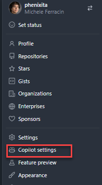
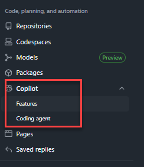

To run these workshops independently, you need to set up a personal GitHub account. This provides you with your own dedicated space to manage code, experiment with projects, and access advanced developer tools like GitHub Copilot.

## What is a personal account

A personal GitHub account is your individual identity on the platform where you store repositories, collaborate with others, and build your developer portfolio.

### What it is in practice

- It is a free, unique user profile tied to your personal email address and username.
- Inside your account, you can create unlimited public or private repositories for your own projects.
- You act as the sole owner and administrator of everything you create under this namespace.

### What is it for

- Version control: securely store, track, and manage changes to your code over time.
- Personal portfolio: showcase your skills, contributions, and open-source projects.
- Access advanced tools: enable developer tools like GitHub Actions, Issues, and GitHub Copilot directly on your account.
- Collaboration: use your identity to fork other projects, submit pull requests, and contribute to external repositories.

## Setup Process

### Create your GitHub account

You need a free personal account to get started with the workshop exercises. 

Visit the [GitHub signup page](https://github.com/signup) and follow the prompts to register.

Reference: [creating an account on GitHub](https://docs.github.com/en/get-started/start-your-journey/creating-an-account-on-github).

### Activate GitHub Copilot

To use AI assistance, you need to subscribe to GitHub Copilot Individual. If you are a verified student, teacher, or maintainer of a popular open-source project, you may be eligible to use it for free.

1. Go to your GitHub account settings by clicking your profile picture in the top right corner. 
2. Navigate to "Copilot" under the "Code, planning, and automation" menu section. 
3. Select "Start your free trial" or "Subscribe to Copilot Individual".
4. Follow the prompts to check, edit, and save your billing information.

### Enable two-factor authentication

Securing your personal account proactively is highly recommended to protect your code and billing information from unauthorized access. 

Reference: [configuring two-factor authentication](https://docs.github.com/en/authentication/securing-your-account-with-two-factor-authentication-2fa/configuring-two-factor-authentication)

1. Go to your account settings and navigate to "Password and authentication".
2. Click the button to enable two-factor authentication.
3. Follow the on-screen steps to set up an authenticator app or SMS verification.

### Install Visual Studio Code

You need Visual Studio Code and the GitHub Copilot extension installed on your local machine to interact with the AI assistant.

1. Download and install Visual Studio Code from [code.visualstudio.com](https://code.visualstudio.com/).
2. Open Visual Studio Code, go to the Extensions view, and search for "GitHub Copilot".
3. Install the extension and sign in with your personal GitHub account when prompted.
 