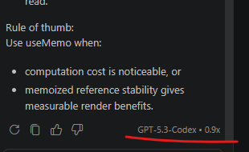
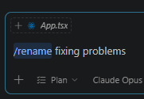

# Workshop 2.1 — VS Code Quick Start with GitHub Copilot


> **Estimated time: 60 minutes** (6 exercises)
>
> **Difficulty: low** — this workshop helps you build confidence with GitHub Copilot in Visual Studio Code through very small, practical steps. You will start your first effective chat session in a real repository, learn how to scope context, compare model choices, keep sessions tidy, and review a tiny safe edit before accepting it.

AI-Assisted Development — Getting Started Module

## Terms and Conditions of Use

This training package is proprietary and confidential and is intended exclusively for the uses described in the training materials. Copying or disclosing all or part of the content and/or software included in these packages is prohibited. The contents of this package are for informational and training purposes only and are provided "as is" without warranties of any kind, express or implied, including, but not limited to, the implied warranties of merchantability, fitness for a particular purpose, and non-infringement. The content of the training package, including URLs and other references to Internet websites, is subject to change without notice. Unless otherwise noted, the companies, organizations, products, domain names, email addresses, logos, people, places, and events depicted herein are fictitious and no association with any real company, organization, product, domain name, email address, logo, person, place, or event is intended or should be inferred.

---

## The Scenario

You have already activated GitHub Copilot in Visual Studio Code. Now you want to move from "it is installed" to "I know how to use it well." You will work inside a small demo repository, ask progressively better questions, keep the session focused, and perform one tiny safe edit with review before accepting it.

> **Remember:** the goal of this workshop is not speed. The goal is to build reliable habits: scope the task, give the right context, pick a sensible model, and review everything before accepting it.

---

## Exercise 1: Get Oriented in a New Repository

This exercise uses Copilot for a realistic beginner task: onboarding into a repository you do not know yet. Instead of comparing an empty chat with a real workspace, you will use Copilot to build a first reading path through the project and then verify whether that guidance is actually useful.

### Prerequisites

Before starting, make sure you have:

- **Visual Studio Code** installed and updated to the latest stable version
- **GitHub Copilot** activated and working (Workshop 1 completed)
- A small **Git repository** open in VS Code
- Optional fallback repository: clone **[Marvel Zombies Hero](https://github.com/phenixita/marvel-zombies-hero/)** if you do not have your own sample project

### Objective

1. Open the Chat view in VS Code
2. Ask Copilot for a newcomer-friendly map of the repository
3. Identify the first files or folders worth reading
4. Verify whether Copilot's guidance matches the actual project structure

**Step 1 — Open Chat in VS Code**

- Open the repository you want to use for practice
- Open the **Chat** view with `Ctrl+Shift+I` / `Cmd+Shift+I`
- Make sure GitHub Copilot is active and a model is selected in the picker.

**Step 2 — Ask for an onboarding map**

- Ask Copilot:
  ```
  I am new to this repository. Give me a quick onboarding map: what is this project for, which folders matter most, and which 3 files should I read first to understand how it works?
  ```
- Read the answer and note the first files or folders Copilot recommends

**Step 3 — Turn the overview into a reading plan**

- Ask a follow-up question such as:
  ```
  If I only have 10 minutes, what should I inspect first and in what order? Keep the answer concrete.
  ```
- Use the answer to build a small reading path through the repository

**Step 4 — Verify the guidance**

- Open the suggested files or folders in the Explorer
- Check whether they really look like:
  - entry points
  - routing/configuration hubs
  - business logic hot spots
- If one suggestion looks weak, ask Copilot to refine the map:
  ```
  That file does not seem central. Suggest a better starting point and explain why.
  ```

### Success Criteria

- [ ] You opened the Chat view in VS Code and used Copilot in a real repository
- [ ] You asked Copilot for an onboarding map of the repository
- [ ] You identified 2-3 files or folders worth reading first
- [ ] You verified whether Copilot's suggestions matched the actual project structure

---

## Exercise 2: Ask Better Questions with Better Context

This exercise teaches you how to scope the model's attention using file, folder, and symbol references instead of asking broad questions against the whole repository.

### Prerequisites

Before starting, make sure you have:

- A repository open in VS Code
- Basic familiarity with the answer from Exercise 1

### Objective

1. Ask a broad question and a scoped question
2. Use file, folder, or symbol references as context
3. Learn when *not* to include the whole repository in the prompt

**Step 1 — Ask a broad question**

- In Chat, ask:
  ```
  Explain how this project handles routing.
  ```
- Observe how broad the answer is and how much the model has to infer

**Step 2 — Scope the question to a file or folder**

- Find the main routing file, app entry point, or a likely folder such as `src/routes`, `app`, or `server`
- Ask a more focused question using context references:
  ```
  Explain how routing works in #src/routes and point me to the main entry file.
  ```
  or
  ```
  Explain what #src/app.ts does and how requests flow from there.
  ```

**Step 3 — Scope the question to a symbol**

- Pick a function, class, or component and ask:
  ```
  Explain #createUser in simple terms and tell me which dependencies it relies on.
  ```
- Compare the quality and specificity of this answer with the broad question

**Step 4 — Learn what not to do**

- Do **not** ask Copilot to "analyze the whole codebase" unless the task truly requires it
- Use only the context needed for the current question:
  - a file when you need implementation detail
  - a folder when you need structure or conventions
  - a symbol when you need behavior or dependencies

### Success Criteria

- [ ] You asked at least one file-scoped question
- [ ] You asked at least one symbol-scoped question
- [ ] You can explain why narrower context usually produces better answers than "look at everything"

---

## Exercise 3: Learn the Model Picker Basics

This exercise introduces the model picker and gives you a practical rule of thumb for choosing between `Auto`, a fast model, and a reasoning model.

### Prerequisites

Before starting, make sure you have:

- Chat open in VS Code
- Access to the model picker in the Chat view

### Objective

1. Identify the `Auto` option in the model picker
2. Compare a fast model and a reasoning model on the same task
3. Build a simple habit for choosing the right model

**Step 1 — Locate the model picker**

- In the Chat view, open the model picker dropdown
- Identify:
  - `Auto`
  - one fast/general-purpose model (e.g.: Gemini Flash, Claude Haiku)
  - one reasoning-oriented model (e.g.: Gemini Pro, GPT 5.x, Claude Sonnet)

**Step 2 — Try the same prompt in two modes**

- Pick a file from the repository
- Use this prompt first with `Auto`:
  ```
  Explain the purpose of this file and suggest one small improvement.
  ```
- Then run the same prompt with a fast model (e.g.: Gemini Flash, Claude Haiku)
- If available, run it again with a reasoning model (e.g.: Gemini Pro, GPT 5.x, Claude Sonnet)
- Check the model that Copilot used for each answer in the response by hovering over the response 

**Step 3 — Compare the trade-offs**

- Look for differences in:
  - speed
  - level of detail
  - confidence in ambiguous areas
  - quality of trade-off reasoning

**Step 4 — Apply the practical rule**

- Use `Auto` when you want a safe default and 10% discount
- Use a fast model for:
  - quick edits
  - simple code questions
  - small transformations
- Use a reasoning model for:
  - architecture questions
  - tricky debugging
  - multi-step tasks

### Success Criteria

- [ ] You found the model picker and identified `Auto`
- [ ] You used the same prompt with at least two different model choices
- [ ] You can explain which model choice you would use for a simple edit versus a more complex task

---

## Exercise 4: Keep Sessions Clean and Focused

This exercise teaches a simple but important habit: when the task changes, the session should usually change too.

### Prerequisites

Before starting, make sure you have:

- Completed at least two prompts in the current chat session

### Objective

1. Rename a session so it reflects the task
2. Start a fresh session for a new task
3. Avoid carrying irrelevant history into unrelated work

**Step 1 — Rename the current session**

- In the Chat view, rename your session to something specific such as:
  - `Repo overview`
  - `Routing walkthrough`
  - `Small UI change`
- To rename use `/rename` command in the message input. 

**Step 2 — Notice when the context becomes stale**

- Ask yourself whether the next task is still about the same topic
- If you are moving from understanding routing to editing a component, the context has changed

**Step 3 — Start a new session for a new task**

- Create a new session from the Chat view
- Ask a clearly different question, for example:
  ```
  Help me improve the wording of this README section.
  ```
- Compare how much cleaner the new conversation feels without previous routing discussion attached

**Step 4 — Use session hygiene as a default habit**

- Start a new session when:
  - the goal changes
  - the files change significantly
  - the current thread contains too much unrelated history
- Keep the old session if you are still working on the same problem

### Success Criteria

- [ ] You renamed a chat session to reflect the task
- [ ] You started a fresh session for a new task
- [ ] You can explain why stale conversation history can reduce answer quality

---

## Exercise 5: Reset Context with `/clear`

This exercise introduces the fastest way to drop stale context from the current conversation and begin again with a clean thread.

### Prerequisites

Before starting, make sure you have:

- An active chat session with a few prompts already completed
- A second task that is clearly unrelated to the current discussion

### Objective

1. Use `/clear` in the current conversation
2. Confirm that the current conversation is archived and a new one is ready
3. Practice treating `/clear` as a context hygiene tool, not just a cleanup action

**Step 1 — Notice when the current thread is no longer useful**

- Look at the current conversation and identify why it is becoming noisy:
  - it contains routing discussion but you now want to work on tests
  - it contains several experiments that are no longer relevant
  - it includes context that could bias the next answer

**Step 2 — Clear the conversation**

- In Chat, type:
  ```
  /clear
  ```
- Submit the command

**Step 3 — Observe what changes**

- Confirm that the current conversation is archived
- Confirm that VS Code prepares a fresh conversation for you
- Notice that the new thread no longer carries the previous task history

**Step 4 — Start the new task cleanly**

- Ask a new unrelated prompt, for example:
  ```
  Help me understand the test structure in this repository.
  ```
- Compare how much cleaner the starting point feels

**Step 5 — Keep the rule simple**

- Use `/clear` when:
  - the conversation has drifted too far
  - you want a hard reset before a new task
  - the current thread has too much stale context
- Prefer keeping the same session only when the work is still part of the same problem

### Success Criteria

- [ ] You used `/clear` in an active conversation
- [ ] You confirmed that the previous conversation was archived and a new one was prepared
- [ ] You can explain when `/clear` is better than continuing the same thread

---

## Exercise 6: Make One Tiny Edit and Review It Properly

This exercise introduces a safe edit workflow: ask for a tiny change, inspect it, and accept or reject it deliberately.

### Prerequisites

Before starting, make sure you have:

- A demo repository open in VS Code
- A small file where a low-risk change is easy to review

### Objective

1. Ask Copilot for one tiny local change
2. Review the proposed edit before accepting it
3. Accept or reject intentionally

**Step 1 — Pick a tiny safe target**

- Choose a small change such as:
  - rename a confusing variable
  - improve a short comment
  - add a missing null check
  - simplify a short conditional

**Step 2 — Ask for a bounded edit**

- Use a narrow prompt such as:
  ```
  In #src/utils/formatDate.ts, suggest one small readability improvement without changing behavior.
  ```
- Keep the request intentionally small and local

**Step 3 — Review the proposed diff**

- Read the proposed change line by line
- Check:
  - did it stay within the requested file?
  - did it preserve behavior?
  - is the naming actually clearer?
  - does the change fit the style of the surrounding code?

**Step 4 — Accept or reject on purpose**

- Accept the edit only if you agree with it
- Reject it if it changes behavior, touches the wrong area, or feels unnecessary

> **Rule to keep:** a proposed edit is never "good because Copilot wrote it." It is good only if *you* understand and approve it.

### Success Criteria

- [ ] You asked for one tiny local change
- [ ] You reviewed the proposed diff before acting
- [ ] You accepted or rejected the edit intentionally rather than automatically

---

## Summary: What You Have Practiced

After this workshop, you should be able to:

| Skill | Outcome |
|------|---------|
| **Start a real session** | Ask useful questions against a real repository |
| **Scope context** | Use file, folder, and symbol references to improve answers |
| **Choose a model** | Pick between `Auto`, fast, and reasoning modes based on the task |
| **Keep sessions clean** | Start a new session when the task changes |
| **Review tiny edits** | Treat proposed changes as drafts to inspect before accepting |

### Next Step

Continue with **Workshop 2.2 — Tools and Control** to learn how Copilot uses tools, how approvals work, and how to stay in control when the assistant starts acting on your behalf.
